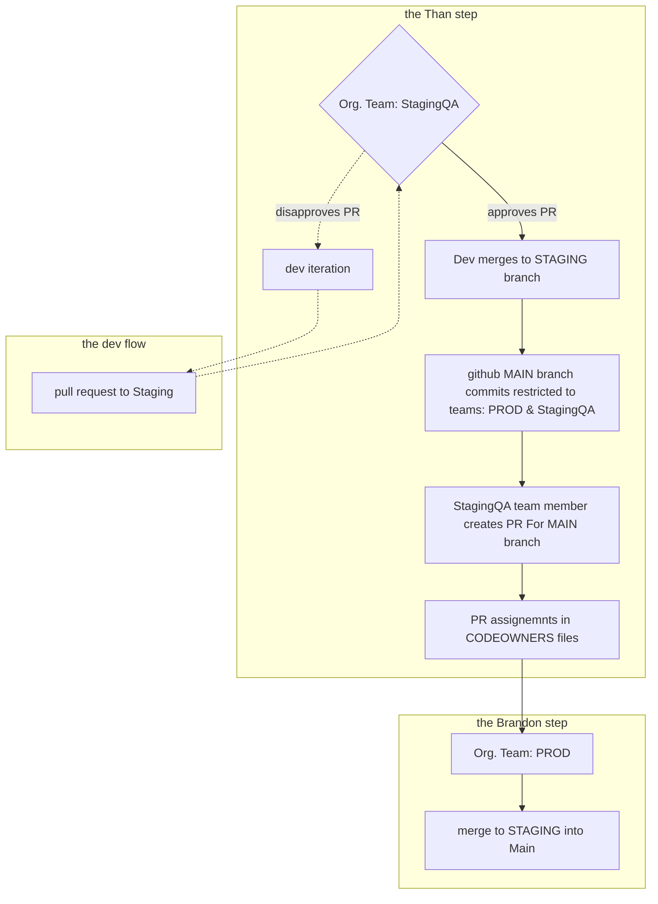

# test-config
config setup testing for clean-and-green-philly 

## the goal

## the obstacle 
GitHub doesn't let you restrict who can perform a merge.

## facts & tools
- CODEOWNERS file can enforce code review
- branch restriction can control who commits a branch
- github has a merge que feature (useful for branches)

## current attempt

